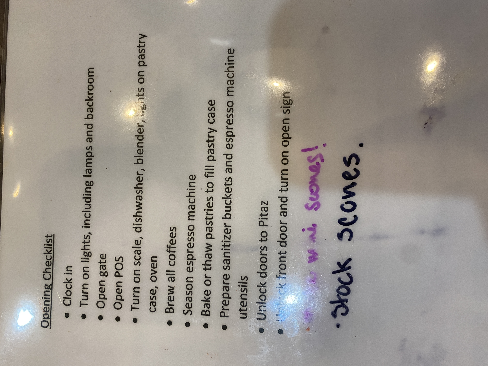

# Opening Checklist

---

**Source Image:** `../images/shift-book/roasters-book-11.JPG`

- Clock in
- Turn on lights, including lamps and backroom
- Open gate
- Open POS
- Turn on scale, dishwasher, blender, lights on pastry case, oven
- Brew all coffees
- Season espresso machine
- Bake or thaw pastries to fill pastry case
- Prepare sanitizer buckets and espresso machine utensils
- Unlock doors to Pitaz
- Unlock front door and turn on open sign

*Handwritten notes:*

- "we mi Scones!" (in purple)
- "stock scones." (in dark blue/black)
