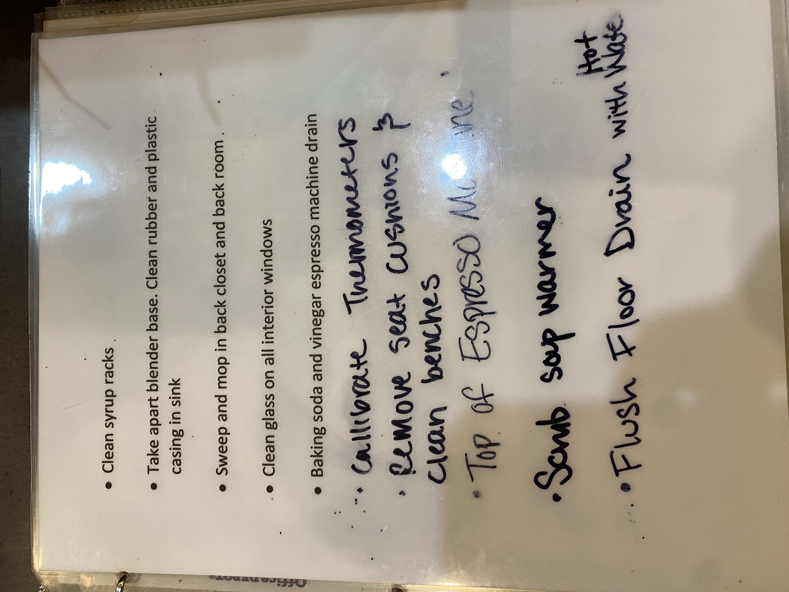

# Cleaning Tasks

---

**Source Image:** `../images/shift-book/roasters-book-12.JPG`

- Clean syrup racks

- Take apart blender base. Clean rubber and plastic casing in sink

- Sweep and mop in back closet and back room

- Clean glass on all interior windows

- Baking soda and vinegar espresso machine drain

*Handwritten notes:*

- Calibrate Thermometers
- Remove seat cushions?
- Clean benches
- Top of Espresso Machine

- Scrub soup warmer

- Flush Floor Drain with Hot Water
