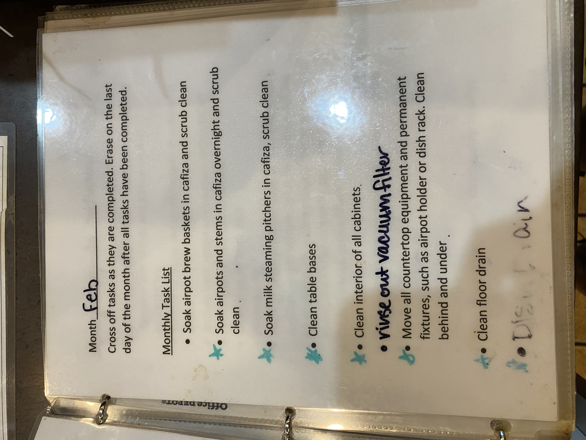

# Roasters Book Page 14

---

**Source Image:** `../images/shift-book/roasters-book-14.JPG`

## Month: Feb

Cross off tasks as they are completed. Erase on the last day of the month after all tasks have been completed.

## Monthly Task List

- Soak airpot brew baskets in cafiza and scrub clean

- ✓ Soak airpots and stems in cafiza overnight and scrub clean

- ✓ Soak milk steaming pitchers in cafiza, scrub clean

- Clean table bases

- Clean interior of all cabinets

- Rinse out vacuum filter

- Move all counter top equipment and permanent fixures, such as

airpot holder or dish rack. Clean behind and under.

- Clean floor drain

- Clean Dish Drain

