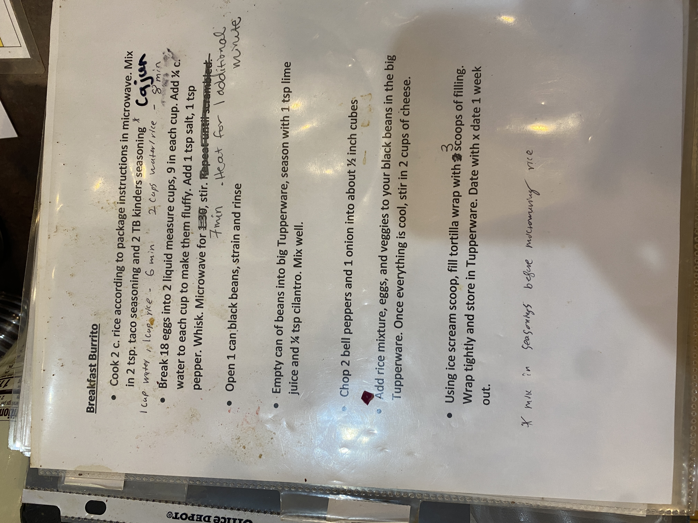

# Roasters Book Page 19

---

**Source Image:** `../images/shift-book/roasters-book-19.JPG`

## Breakfast Burritos

**cook 2 c. of rice according to package instructions in microwave. Mix in 1 tsp taco seasoning and 2 TB. kinders seasoning**

• Heat 18 eggs into 2 liquid measure cups, 9 in each cup. Add ¼ c. pepper, whisk. Microwave for 30 sec, stir. Repeat until set, 1 tsp salt, 1 tsp pepper

• Open 1 can black beans, strain and rinse

• Empty can of beans into alg. Tupperware, season with 1 tsp lime juice and ¼ tsp cilantro. Mix well.

• Chop 2 bell peppers and 1 onion into about ½ inch cubes.

• Add rice mixture, eggs and veggies to your black beans in the big Tupperware. Once everything is cool, stir in 2 cups of cheese

• Using ice cream scoop, fill tortilla wrap with 3 scoops of filling. Wrap tightly and store in Tupperware. Date with x date 1 week

---

*~milk & Splenda before microwaving rice*
