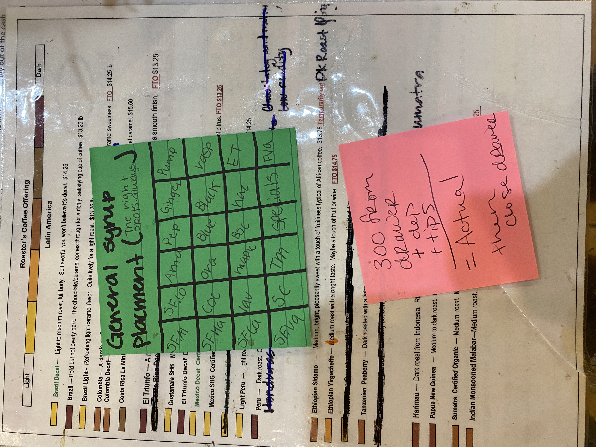

# Syrup Placement Chart

---

**Source Image:** `../images/shift-book/roasters-book-2.JPG`

## Syrup Placement Chart

**General syrup placement (The right spots always)**

|------|------|-------|--------|-------|------|
| SF.AI | SF.Co | Ama  | Pep   | Ginger | Pump  |
| SF.HA | Coc   | Ora  | Blue  | Black | rasp |
| SF.CA | Lav   | Mar  | BSC   | Haz    | ET    |
| SF.VA | SC    | Tm   | Specials    | FVA   |

---

## Cash Drawer Closing Notes

- **300 from drawer + deposit + tips = Actual!**  
- Then close drawer
