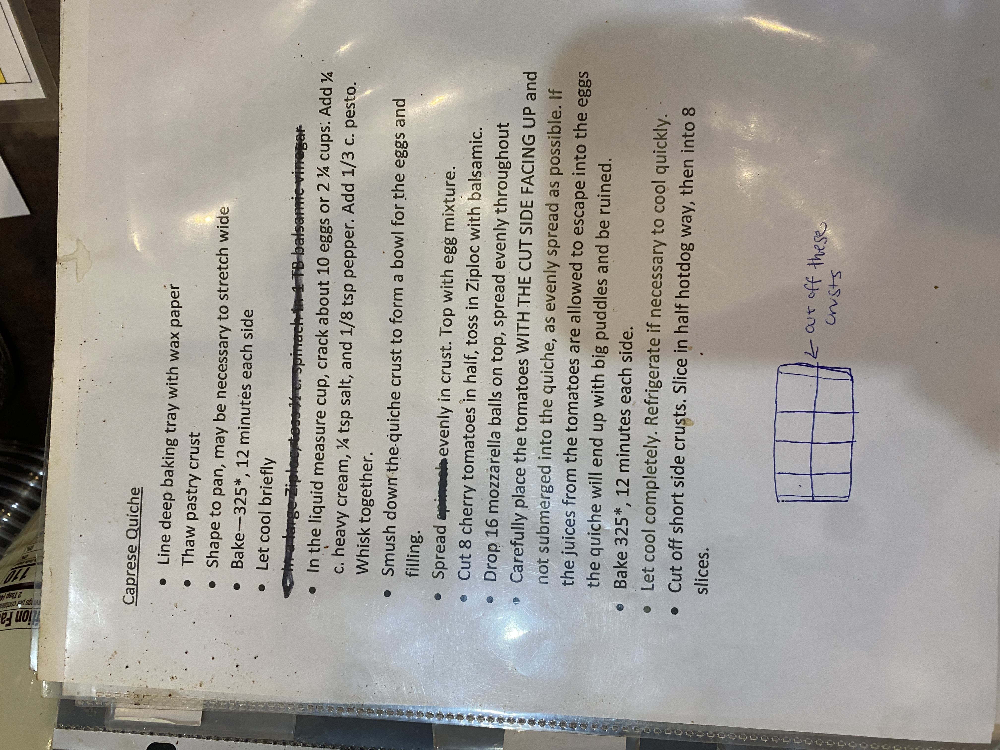

# Roasters Book Page 21

---

**Source Image:** `../images/shift-book/roasters-book-21.JPG`

## Caprese Quiche

• Line deep baking tray with wax paper

• Thaw pastry crust

• Shape to pan, may be necessary to stretch wide

• Bake ~325*, 12 minutes each side

• Let cool briefly

• In the liquid measure cup, crack about 10 eggs or 2 ¼ cups. Add ¼ c heavy cream, ¼ tsp salt and 1/8 tsp pepper. Add ¼ c pesto.

• Whisk together.

• Smush down the quiche crust to form a bowl for the eggs and filling.

• Spread tomatoes evenly in crust. Top with egg mixture.

• Cut 8 diem tomatoes in half, toss in 2tbsp with balsamic.

• Drop 16 mozzarella balls on top, spread evenly throughout.

• Carefully place the tomatoes WITH THE CUT SIDE FACING UP and not clumped into the quiche as evenly spread as possible. If the juices from the tomatoes are allowed to escape into the eggs not clumped into the quiche as evenly spread as possible. If the quiche will end up with big puddles and be ruined.

• Bake 325*, 12 minutes each side.

• Let cool completely. Refrigerate if necessary to cool quickly.

• Cut off short side crusts. Slice in half hotdog way, then into 8 slices.

---

[DIAGRAM: Simple sketch showing rectangular cuts labeled "CRUSTS"] See above image.
