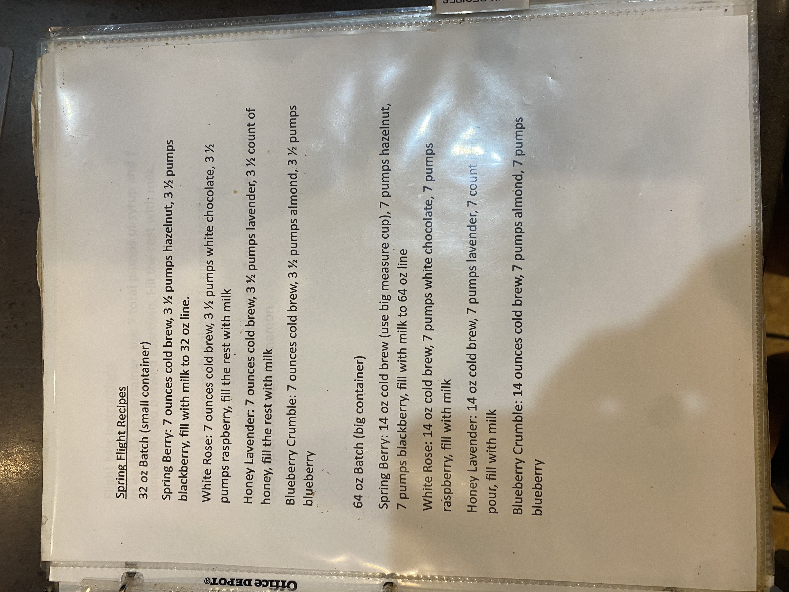

# Roasters Book Page 23

---

**Source Image:** `../images/shift-book/roasters-book-23.JPG`

Sugar Flight Recipes

32 oz Batch (small container)

---

- Spring Berry: 7 ounces cold brew, 3 ½ pumps hazelnut, 3 ½ pumps
blackberry, fill with milk to 32 oz line

- White Rose: 7 ounces cold brew, 3 ½ pumps white chocolate, 3 ½
pumps raspberry, fill the rest with milk

- Honey Lavender: 7 ounces cold brew, 3 ½ pumps lavender, 3 ½ count of
honey, fill the rest with milk

- Blueberry Crumble: 7 ounces cold brew, 3 ½ pumps almond, 3 ½ pumps
blueberry

64 oz Batch (big container)

---

Spring Berry: 14 oz cold brew (use big measure cup), 7 pumps hazelnut,
7 pumps blackberry, fill with milk to 64 oz line

- White Rose: 14 oz cold brew, 7 pumps white chocolate, 7 pumps
raspberry, fill with milk

- Honey Lavender: 14 oz cold brew, 7 pumps lavender, 7 count pour fill with milk

- Blueberry Crumble: 14 ounces cold brew, 7 pumps almond, 7 pumps
blueberry
