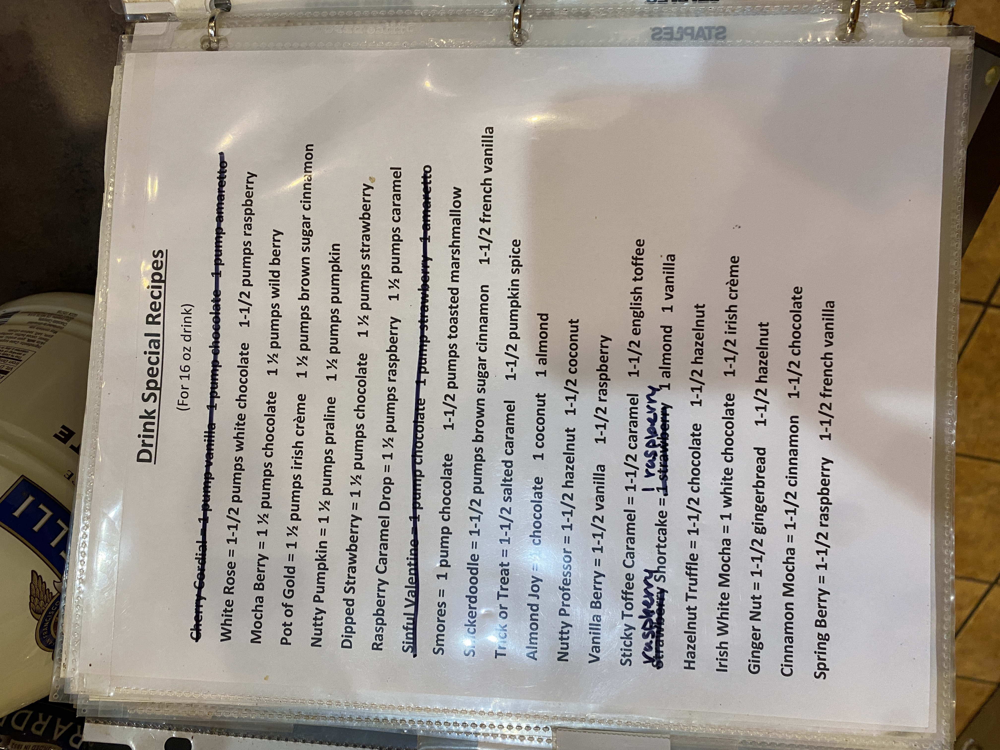

# Roasters Book Page 29

---

**Source Image:** `../images/shift-book/roasters-book-29.JPG`

## Drink Special Recipes

*(For 16 oz drink)*

- **Cherry Cordial** = 1-1/2 pumps white chocolate, 1-1/2 pumps raspberry, mocha base
- **White Rose** = 1-1/2 pumps white chocolate, 1-1/2 pumps wild berry
- **Mocha Berry** = 1/2 pumps mocha chocolate, 1/2 pumps wild berry
- **Pot of Gold** = 1 1/2 pumps Irish creme, 1/2 pumps brown sugar cinnamon
- **Nutty Pumpkin** = 1 1/4 pumps praline, 1/4 pumps pumpkin muffin
- **Dipped Strawberry** = 1 1/2 pumps chocolate, 1/4 pumps strawberry
- **Raspberry Caramel Drop** = 1 1/4 pumps raspberry, 1 1/4 pumps caramel
- **Snickers Macchiato** = *pump/pour/top/repeat* = 1-1/2 pumps caramel, 1-1/2 pumps chocolate
- **S'mores** = 1 pump chocolate, 1-1/2 pumps brown sugar cinnamon, 1-1/2 pumps toasted marshmallow
- **Salted Caramel** = 1-1/2 pumps brown sugar cinnamon, 1-1/2 pumps caramel
- **Tickled Treat** = 1-1/2 pumps praline
- **Almond Joy** = chocolate, 1 coconut, 1 almond
- **Nutty Professor** = 1-1/2 hazelnut, 1-1/2 coconut
- **Vanilla Bean** = 1-1/2 vanilla, 1-1/2 raspberry
- **Sticky Toffee Caramel** = 1-1/2 caramel, 1-1/2 english toffee
- **Kentucky Shortcake** = 1 Kentucky (*Raspberry*), almond, 1 vanilla
- **Hazelnut Traffic** = 1-1/2 chocolate, 1-1/2 hazelnut
- **Irish White Mocha** = 1 white chocolate, 1-1/2 Irish creme
- **Ginger Ninja** = 1-1/2 gingerbread, 1-1/2 hazelnut
- **Cinnamon Mocha** = 1-1/2 cinnamon, 1
