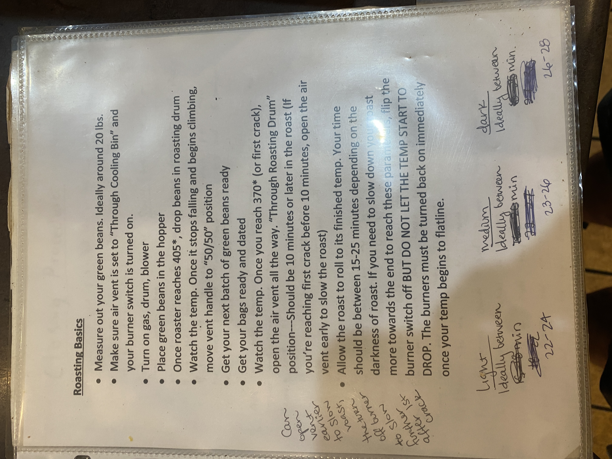

# Roasters Book Page 32

---

**Source Image:** `../images/roasters-book/roasters-book-32.JPG`

# Roasting Basics

* Measure out your green beans. Ideally around 20 lbs.
* Make sure air vent is set to "Through Cooling Bin" and your burner switch is turned on.
* Turn on gas, drum, blower
* Place green beans in the hopper
* Once roaster reaches 405*, drop beans in roasting drum
* Watch the temp. Once it stops falling and begins climbing, move vent handle to "50/50" position
* Get your next batch of green beans ready
* Get your bags ready and dated
* Watch the temp. Once you reach 370* (or first crack), open the air vent all the way. "Through Roasting Drum" position—Should be 10 minutes or later in the roast (If you're reaching first crack before 10 minutes, open the air vent early to slow the roast)
* Allow the roast to roll to its finished temp. Your time should be between 15-25 minutes depending on the darkness of roast. If you need to slow down your roast more towards the end to reach these parameters, flip the burner switch off BUT DO NOT LET THE TEMP START TO DROP. The burners must be turned back on immediately once your temp begins to flatline.

---

**Notes:**

* Can open vent earlier to slow roast, then turn off burner to slow further after 1st crack

---

### Roast Timing Guidelines

**Light**

* Ideally between 22-24 min

**Medium**

* Ideally between 23-26 min

**Dark**

* Ideally between 26-28 min
