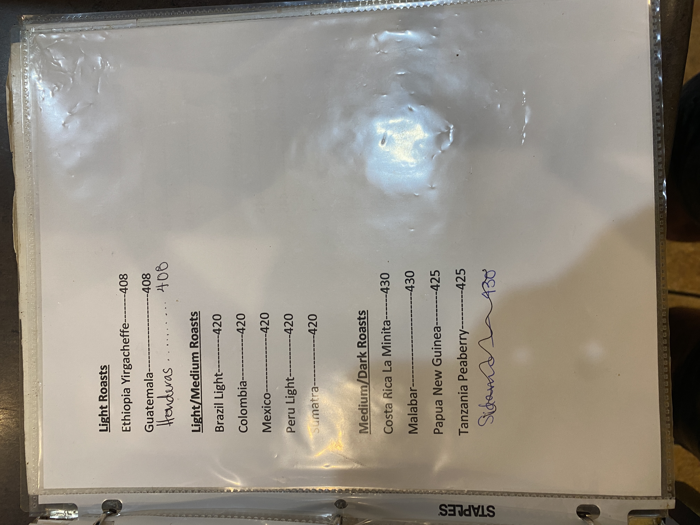

# Roasters Book Page 34

---

**Source Image:** `../images/shift-book/roasters-book-34.JPG`

## Coffee Roasts

## Light Roasts

| Origin | Temperature |
|--------|-------------|
| Ethiopia Yirgacheffe | 408°F |
| Guatemala | 408°F |
| Honduras | 408°F |

## Light/Medium Roasts

| Origin | Temperature |
|--------|-------------|
| Brazil Light | 420°F |
| Colombia | 420°F |
| Mexico | 420°F |
| Peru Light | 420°F |
| Sumatra | 420°F |

## Medium/Dark Roasts

| Origin | Temperature |
|--------|-------------|
| Costa Rica La Minita | 430°F |
| Malabar | 430°F |
| Papua New Guinea | 425°F |
| Tanzania Peaberry | 425°F |
| Sidama | 430°F |

---

*Coffee roasting temperature guide*
