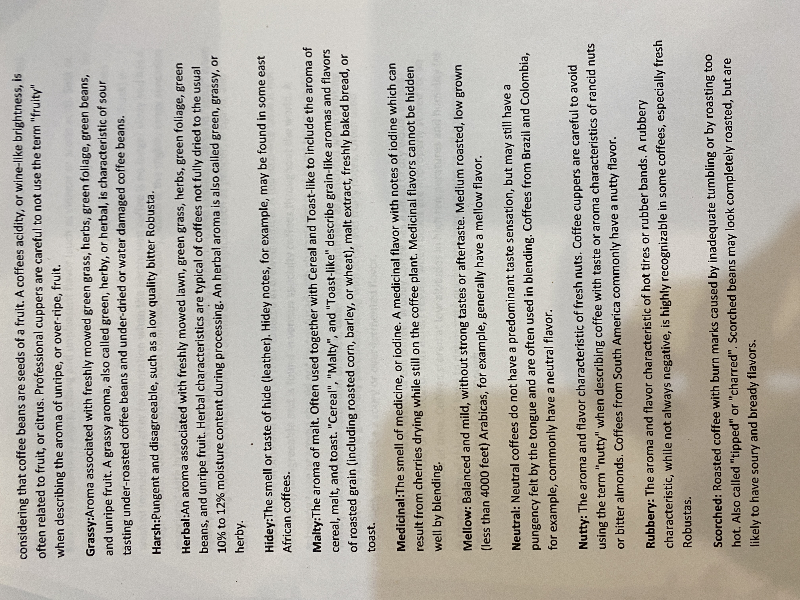

# Roasters Book Page 43

---

**Source Image:** `../images/shift-book/roasters-book-43.JPG`

## Coffee Tasting Terms

considering that coffee beans are seeds of a fruit. A coffees acidity, or wine-like brightness, is often related to fruit, or citrus. Professional cuppers are careful to not use the term "fruity" when describing the aroma of unripe, or over-ripe, fruit.

**Grassy:** Aroma associated with freshly mowed green grass, herbs, green foliage, green beans, and unripe fruit. A grassy aroma, also called green, herby, or herbal, is characteristic of sour tasting under-roasted coffee beans and under-dried or water damaged coffee beans.

**Harsh:** Pungent and disagreeable, such as a low quality bitter Robusta.

**Herbal:** An aroma associated with freshly mowed lawn, green grass, herbs, green foliage, green beans, and unripe fruit. Herbal characteristics are typical of coffees not fully dried to the usual 10% to 12% moisture content during processing. An herbal aroma is also called green, grassy, or herby.

**Hidey:** The smell or taste of hide (leather). Hidey notes, for example, may be found in some east African coffees.

**Malty:** The aroma of malt. Often used together with Cereal and Toast-like to include the aroma of cereal, malt, and toast. "Cereal", "Malty", and "Toast-like" describe grain-like aromas and flavors of roasted grain (including roasted corn, barley, or wheat), malt extract, freshly baked bread, or toast.

**Medicinal:** The smell of medicine, or iodine. A medicinal flavor with notes of iodine which can result from cherries drying while still on the coffee plant. Medicinal flavors cannot be hidden well by blending.

**Mellow:** Balanced and mild, without strong tastes or aftertaste. Medium roasted, low grown (less than 4000 feet) Arabicas, for example, generally have a mellow flavor.

**Neutral:** Neutral coffees do not have a predominant taste sensation, but may still have a pungency felt by the tongue and are often used in blending. Coffees from Brazil and Colombia, for example, commonly have a neutral flavor.

**Nutty:** The aroma and flavor characteristic of fresh nuts. Coffee cuppers are careful to avoid using the term "nutty" when describing coffee with taste or aroma characteristics of rancid nuts or bitter almonds. Coffees from South America commonly have a nutty flavor.

**Rubbery:** The aroma and flavor characteristic of hot tires or rubber bands. A rubbery characteristic, while not always negative, is highly recognizable in some coffees, especially fresh Robustas.

**Scorched:** Roasted coffee with burn marks caused by inadequate tumbling or by roasting too hot. Also called "tipped" or "charred". Scorched beans may look completely roasted, but are likely to have soury and bready flavors.
