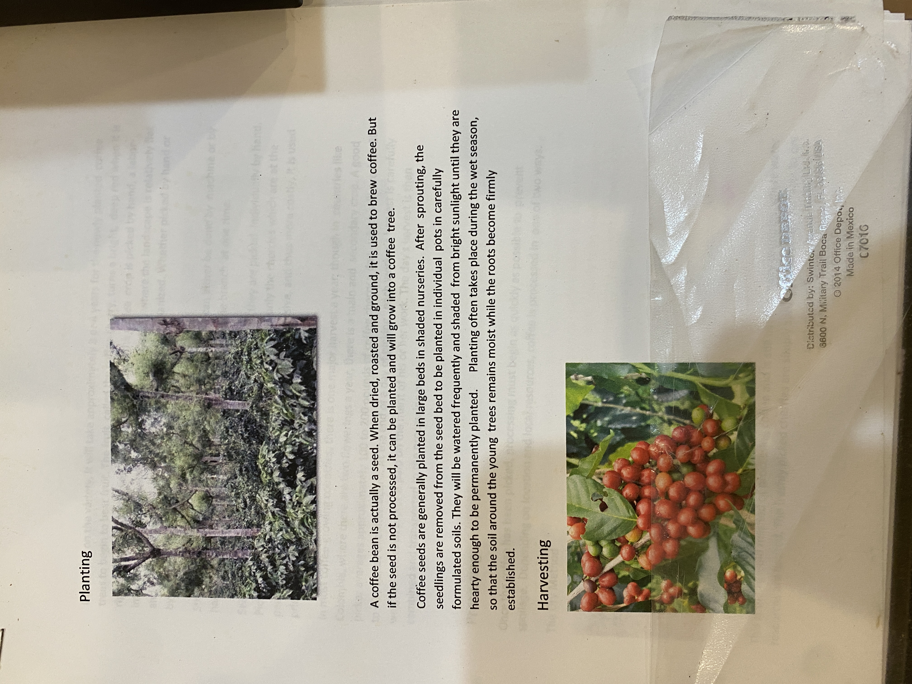

# Roasters Book Page 46

---

**Source Image:** `../images/shift-book/roasters-book-46.JPG`

## Planting

A coffee bean is actually a seed. When dried, roasted and ground, it is used to brew coffee. But if the seed is not processed, it can be planted and will grow into a coffee tree.

Coffee seeds are generally planted in large beds in shaded nurseries. After sprouting, the seedlings are removed from the seed bed to be planted in individual pots in carefully formulated soils. They will be watered frequently and shaded from bright sunlight until they are hearty enough to be permanently planted. Planting often takes place during the wet season, so that the soil around the young trees remains moist while the roots become firmly established.

## Harvesting

