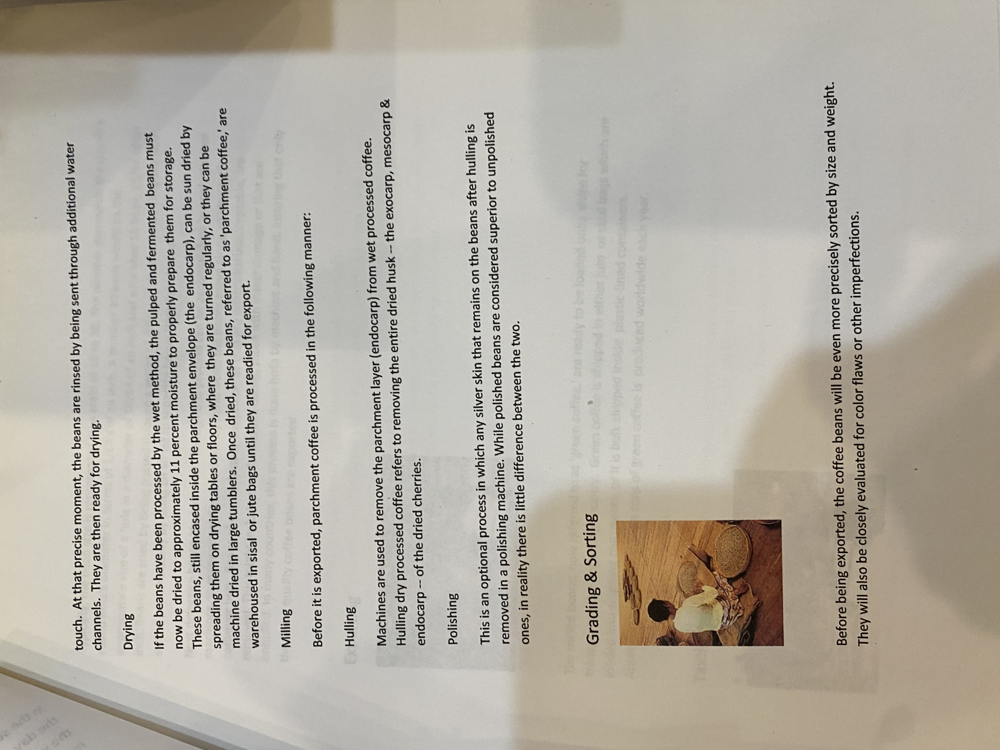

# Roasters Book Page 49

---

**Source Image:** `../images/shift-book/roasters-book-49.JPG`

in the sun. In order to prevent the cherries from spoiling, they are raked and turned throughout the day, then covered at night, or if it rains, to prevent them from getting wet. Depending on the weather, this process might continue for several weeks for each batch of coffee. When the moisture content of the cherries drops to 11 percent, the dried cherries are moved to warehouses where they are stored

## The Wet Method

In wet method processing, the pulp is removed from the coffee cherry after harvesting and the bean is dried with only the parchment skin left on. There are several actual steps involved. First, the freshly harvested cherries are passed through a pulping machine where the skin and pulp is separated from the bean. The pulp is washed away with water, usually to be dried and used as mulch. The beans are separated by weight as they are conveyed through water channels, the lighter beans floating to the top, while the heavier, ripe beans sink to the bottom.

Next they are passed through a series of rotating drums which separate them by size.

After separation, the beans are transported to large, water-filled fermentation tanks. Depending on a combination of factors -- such as the condition of the beans, the climate and the altitude -- they will remain in these tanks for anywhere from 12 to 48 hours. The purpose of this process is to remove the slick layer of mucilage (called the parenchyma) that is still attached to the parchment; while resting in the tanks, naturally occurring enzymes will cause this layer to dissolve. When fermentation is complete the beans will feel rough, rather than slick, to the
