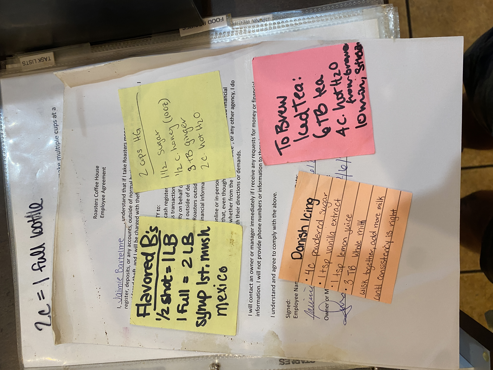

# Sticky Notes Recipes



---

**Source Image:** `../images/shift-book/roasters-book-5.JPG`

### Yellow Sticky Note (Left)

```
Flavored B's
½ shot = 1 LB
1 Full = 2 LB
syrup 1st, mush
mexico
```

### Yellow Sticky Note (Right)

```
2 cups 4G
11½ sugar
½ c. honey (100?)
3 TB ginger
2 c. hot H2O
```

### Orange Sticky Note

```
Danish Icing
¼ c. powdered sugar
1 tsp vanilla extract
1 tsp lemon juice
3 TB whole milk
whisk together, add more milk
until consistency is right
```

### Pink Sticky Note

```
To Brew
Iced Tea:
6 TB tea
4 c. hot H2O
from brew
10 min, strain
```
