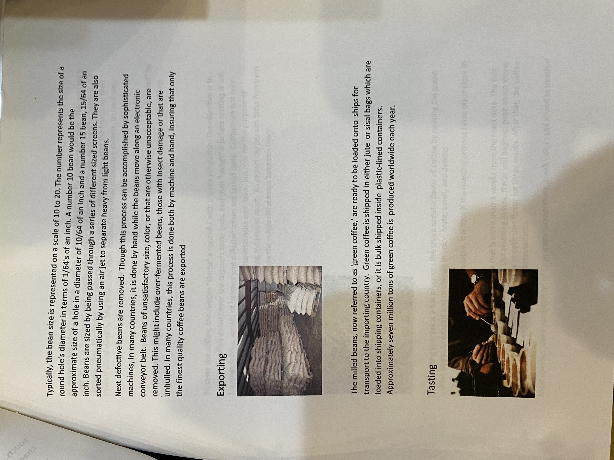

# Roasters Book Page 50

---

**Source Image:** `../images/shift-book/roasters-book-50.JPG`

touch. At that precise moment, the beans are rinsed by being sent through additional water channels. They are then ready for drying.

## Drying

If the beans have been processed by the wet method, the pulped and fermented beans must now be dried to approximately 11 percent moisture to properly prepare them for storage. These beans, still encased inside the parchment envelope (the endocarp), can be sun dried by spreading them on drying tables or floors, where they are turned regularly, or they can be machine dried in large tumblers. Once dried, these beans, referred to as 'parchment coffee,' are warehoused in sisal or jute bags until they are readied for export.

### Milling

Before it is exported, parchment coffee is processed in the following manner:

#### Hulling

Machines are used to remove the parchment layer (endocarp) from wet processed coffee. Hulling dry processed coffee refers to removing the entire dried husk -- the exocarp, mesocarp & endocarp -- of the dried cherries.

#### Polishing

This is an optional process in which any silver skin that remains on the beans after hulling is removed in a polishing machine. While polished beans are considered superior to unpolished ones, in reality there is little difference between the two.

## Grading & Sorting

Before being exported, the coffee beans will be even more precisely sorted by size and weight. They will also be closely evaluated for color flaws or other imperfections.
