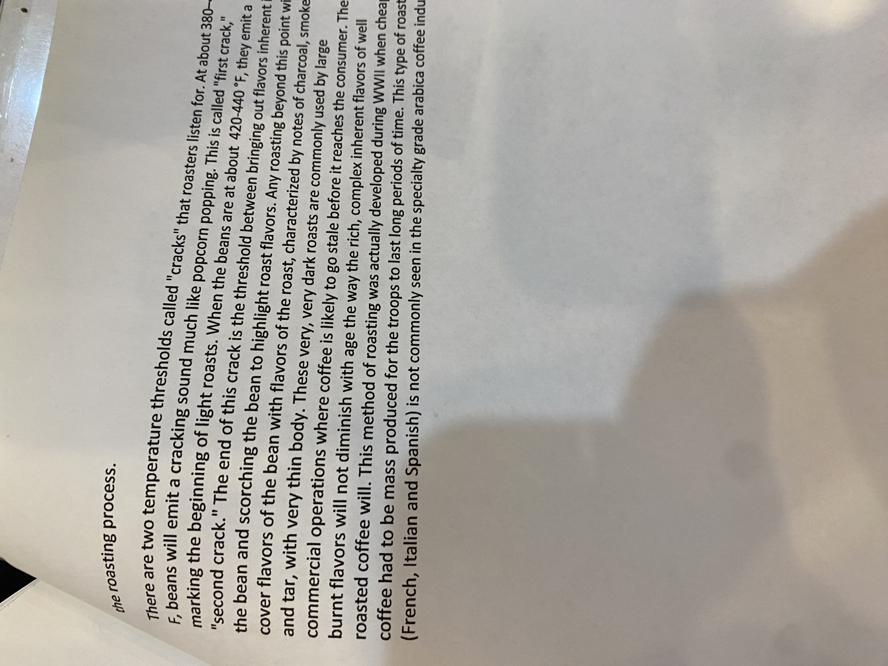

# Roasters Book Page 52

---

**Source Image:** `../images/shift-book/roasters-book-52.JPG`

Here's the continuation of the text in markdown:

---

## the roasting process

There are two temperature thresholds called "cracks" that roasters listen for. At about 380°F, beans will emit a cracking sound much like popcorn popping. This is called "first crack," marking the beginning of light roasts. When the beans are at about 420-440°F, they emit a "second crack." The end of this crack is the threshold between bringing out flavors inherent in the bean and scorching the bean to highlight roast flavors. Any roasting beyond this point will cover flavors of the bean with flavors of the roast, characterized by notes of charcoal, smoke and tar, with very thin body. These very, very dark roasts are commonly used by large commercial operations where coffee is likely to go stale before it reaches the consumer. The burnt flavors will not diminish with age the way the rich, complex inherent flavors of well roasted coffee will. This method of roasting was actually developed during WWII when cheap coffee had to be mass produced for the troops to last long periods of time. This type of roast (French, Italian and Spanish) is not commonly seen in the specialty grade arabica coffee industry.
