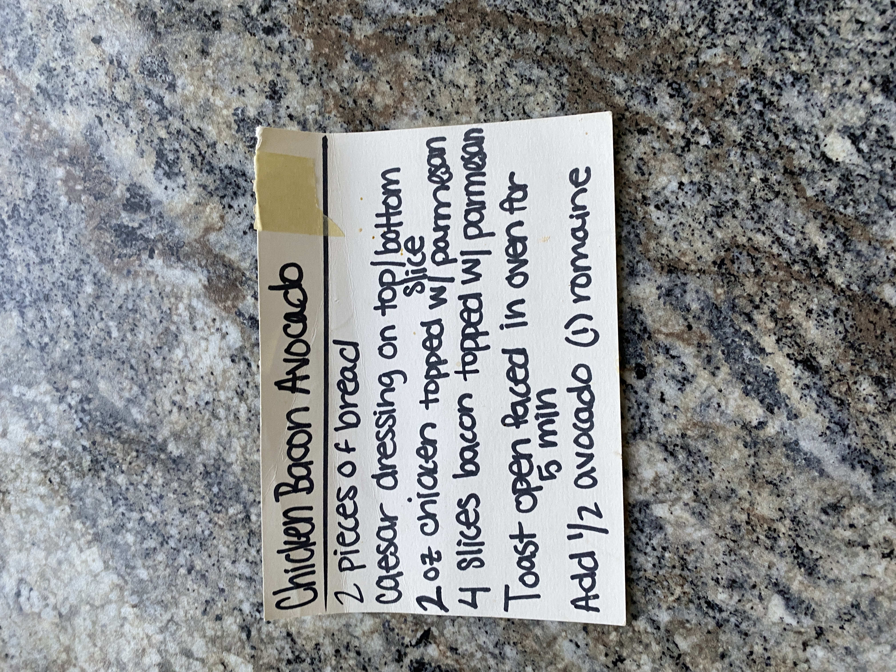

# Cook Book Recipe 49

---

**Source Image:** `../images/cook-book/cook-book-recipe-49.JPG`

## Chicken Bacon Avocado

## Ingredients

- 2 pieces of bread
- Caesar dressing on top/bottom slice
- 2 oz chicken topped w/ parmesan
- 4 slices bacon topped w/ parmesan

## Instructions

1. Toast open faced in oven for 5 min
2. Add ½ avocado (!) romaine
