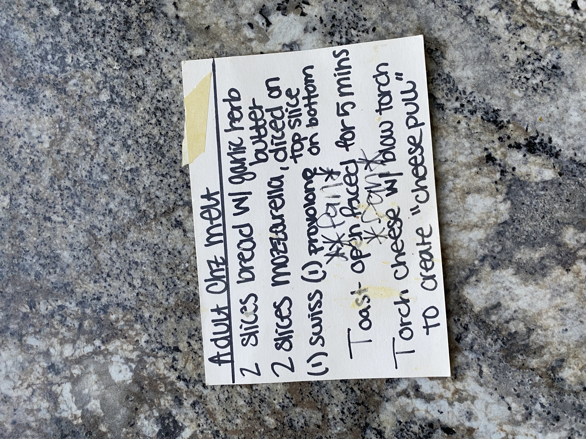

# Cook Book Recipe 56

---

**Source Image:** `../images/cook-book/cook-book-recipe-56.JPG`
Here's the text from the image in markdown format:

## Adult Chz Melt

- 2 slices bread w/ garlic herb butter
- 2 slices mozzarella, diced on top slice
- (1) Swiss (1) provolone or bottom
- Toast open faced for 5 mins
- Torch cheese w/ blow torch to create "cheese pull"
