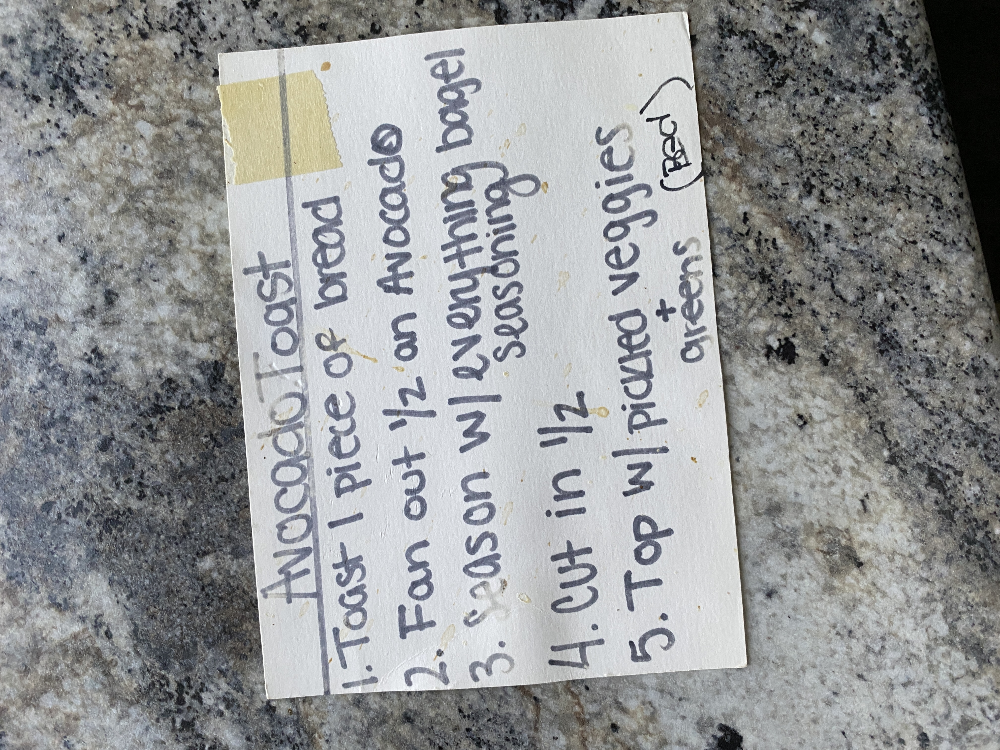

# Cook Book Recipe 57

---

**Source Image:** `../images/cook-book/cook-book-recipe-57.JPG`
Here's the text from the image in markdown format:

## Avocado Toast

1. Toast 1 piece of bread
2. Fan out ½ an Avocado
3. Season w/ everything bagel seasoning
4. Cut in ½
5. Top w/ pickled veggies + greens
