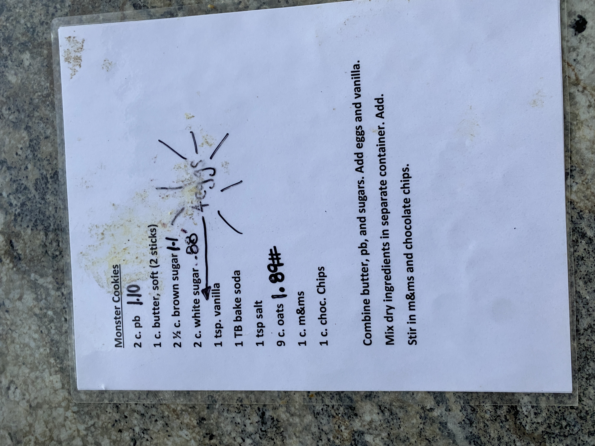

# Cook Book Recipe 60

---

**Source Image:** `../images/cook-book/cook-book-recipe-60.JPG`

## Monster Cookies

- 2 c. pb - **1.10**
- 1 c. butter, soft (2 sticks)
- 2 ½ c. brown sugar - **1-1**
- 2 c. white sugar - **~~.08~~** - **4 eggs**
- 1 tsp. vanilla
- 1 TB bake soda
- 1 tsp salt
- 9 c. oats - **1.80#**
- 1 c. m&ms
- 1 c. choc. Chips

Combine butter, pb, and sugars. Add eggs and vanilla.

Mix dry ingredients in separate container. Add.

Stir in m&ms and chocolate chips.
