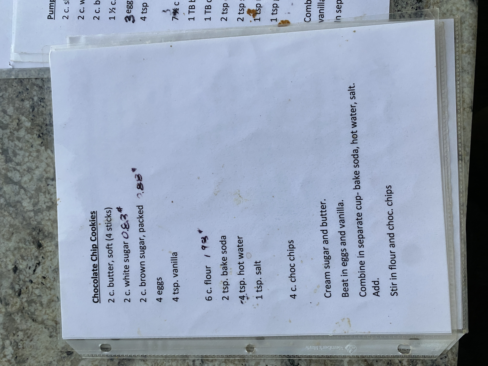

# Cook Book Recipe 64

---

**Source Image:** `../images/cook-book/cook-book-recipe-64.JPG`

## Chocolate Chip Cookies

## Ingredients

- 2 c. butter, soft (4 sticks)
- 2 c. white sugar *0.83#*
- 2 c. brown sugar, packed *2.83#*
- 4 eggs
- 4 tsp. vanilla
- 6 c. flour *1 9#*
- 2 tsp. bake soda
- 4 tsp. hot water
- 1 tsp. salt
- 4 c. choc chips

## Instructions

Cream sugar and butter.

Beat in eggs and vanilla.

Combine in separate cup- bake soda, hot water, salt.

Add.

Stir in flour and choc. chips
